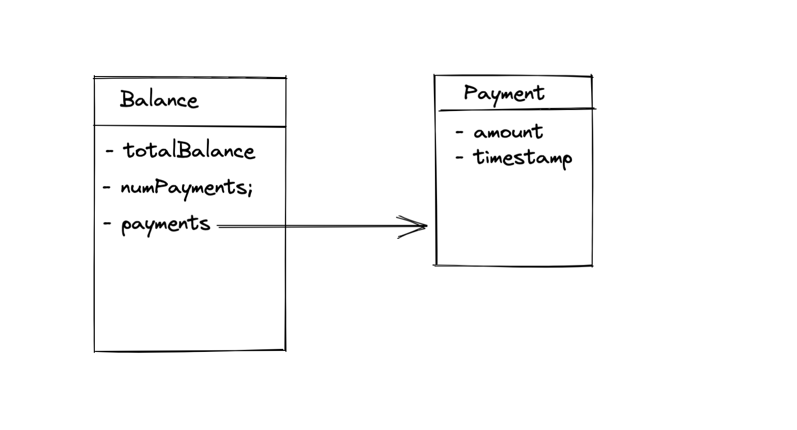

# Solidity Introduction

**Table of Content:**

- [Solidity Introduction](#solidity-introduction)
  - [Prerequisite](#prerequisite)
  - [First Smart Contract](#first-smart-contract)
  - [Deploy your Smart Contract](#deploy-your-smart-contract)
  - [Blockchain Network](#blockchain-network)
  - [Solidity Basics- Variables](#solidity-basics--variables)
  - [Mapping and Structs](#mapping-and-structs)
  - [Deposit and withdraw](#deposit-and-withdraw)
  - [Smart Contract Life-cycle](#smart-contract-life-cycle)
  - [Complex Examples - Map and Struct](#complex-examples---map-and-struct)
  - [Known Facts](#known-facts)
  - [Exception Handling](#exception-handling)
    - [Add a Require](#add-a-require)
    - [Add an Assert](#add-an-assert)
      - [Difference between require and assert](#difference-between-require-and-assert)
    - [Try/Catch](#trycatch)

## Prerequisite

1. Remix IDE - https://remix.ethereum.org/
2. MetaMax Setup

## First Smart Contract

```solidity
// SPDX-License-Identifier: GPL-3.0

pragma solidity ^0.8.1;

contract Contract01 {
    string public myString = "hello world";
}
```

**Note:** 'public' will generate automatic getter

## Deploy your Smart Contract

1. Open "Deploy & Run Transactions" plugin
2. Injected web3
3. Connect and Deploy
4. Interact with contract

## Blockchain Network

1. Injected web3
2. Javascript VM
3. Web3 Provider

## Solidity Basics- Variables

```solidity
pragma solidity ^0.8.1;

contract Person {
    string public name;
    uint256 public age;
    address public paddress;

    function setDetail(string memory _name, uint256 _age)
        public
        returns (
            string memory,
            uint256,
            address
        )
    {
        name = _name;
        age = _age;
        paddress = msg.sender;
        return (name, age, paddress);
    }
}
```

**Overflow and Underflow:**

```solidity
// SPDX-License-Identifier: GPL-3.0
pragma solidity 0.7.0;

contract RolloverExample {
    uint8 public myUint8;

    function decrement() public {
        myUint8--;
    }

    function increment() public {
        myUint8++;
    }
}
```

**Error:**

```solidity
// SPDX-License-Identifier: GPL-3.0
pragma solidity 0.8.0;

contract RolloverExample2 {
    uint8 public myUint8;

    function decrement() public {
        myUint8--;
    }

    function increment() public {
        myUint8++;
    }
}
```

**Unchecked:**

```solidity
// SPDX-License-Identifier: GPL-3.0
pragma solidity 0.8.0;

contract RolloverExample2 {
    uint8 public myUint8;

    function decrement() public {
        unchecked {
            myUint8--;
        }
    }

    function increment() public {
        unchecked {
            myUint8++;
        }
    }
}
```

## Mapping and Structs



```solidity
pragma solidity ^0.8.4;

contract MappingsStructExample {
    struct Payment {
        uint256 amount;
        uint256 timestamp;
    }

    struct Balance {
        uint256 totalBalance;
        uint256 numPayments;
        mapping(uint256 => Payment) payments;
    }

    mapping(address => Balance) public balanceReceived;

    function getBalance() public view returns (uint256) {
        return address(this).balance;
    }
}
```

**Ethereum Denominations**

- A short reminder on Ethereum Denominations. Wei is the smallest, Ether = 10^18 Wei.

| Unit  | Wei Exp | Wei                       |
| ----- | ------- | ------------------------- |
| wei   | 1       | 1                         |
| Kwei  | 10^3    | 1,000                     |
| Mwei  | 10^6    | 1,000,000                 |
| Gwei  | 10^9    | 1,000,000,000             |
| Ether | 10^18   | 1,000,000,000,000,000,000 |

## Deposit and withdraw

```solidity
pragma solidity ^0.8.1;

contract SendMoneyExample {
    uint256 public balanceReceived;

    function receiveMoney() public payable {
        balanceReceived += msg.value;
    }

    function getBalance() public view returns (uint256) {
        return address(this).balance;
    }
}
```

**Withdraw**

```solidity
// SPDX-License-Identifier: GPL-3.0

pragma solidity ^0.8.1;

contract SendMoneyExample1 {
    uint256 public balanceReceived;

    function receiveMoney() public payable {
        balanceReceived += msg.value;
    }

    function getBalance() public view returns (uint256) {
        return address(this).balance;
    }

    /**withdrawMoney**/
    function withdrawMoney() public {
        address payable to = payable(msg.sender);
        to.transfer(getBalance());
    }
}
```

**Withdraw to a account**

```solidity
// SPDX-License-Identifier: GPL-3.0

pragma solidity ^0.8.1;

contract SendMoneyExample {
    uint256 public balanceReceived;

    function receiveMoney() public payable {
        balanceReceived += msg.value;
    }

    function getBalance() public view returns (uint256) {
        return address(this).balance;
    }

    function withdrawMoney() public {
        address payable to = payable(msg.sender);
        to.transfer(getBalance());
    }

    function withdrawMoneyTo(address payable _to) public {
        _to.transfer(getBalance());
    }
}
```

## Smart Contract Life-cycle

**Unsecure Smart Contract**

```solidity
pragma solidity ^0.8.1;

contract StartStopUpdateExample {
    function sendMoney() public payable {}

    function withdrawAllMoney(address payable _to) public {
        _to.transfer(address(this).balance);
    }
}
```

**constructor and ownership**

```solidity
// SPDX-License-Identifier: GPL-3.0
pragma solidity ^0.8.1;

contract StartStopUpdateExample {
    address public owner;

    constructor() {
        owner = msg.sender;
    }

    function sendMoney() public payable {}

    function withdrawAllMoney(address payable _to) public {
        require(owner == msg.sender, "You cannot withdraw.");
        _to.transfer(address(this).balance);
    }
}
```

**Pause and destroy**

```solidity
// SPDX-License-Identifier: GPL-3.0
pragma solidity ^0.8.1;

contract StartStopUpdateExample {
    address public owner;
    bool public paused;

    constructor() {
        owner = msg.sender;
    }

    function sendMoney() public payable {}

    function setPaused(bool _paused) public {
        require(msg.sender == owner, "You are not the owner");
        paused = _paused;
    }

    function withdrawAllMoney(address payable _to) public {
        require(owner == msg.sender, "You cannot withdraw.");
        require(paused == false, "Contract Paused");
        _to.transfer(address(this).balance);
    }

    function destroySmartContract(address payable _to) public {
        require(msg.sender == owner, "You are not the owner");
        selfdestruct(_to);
    }
}
```

## Complex Examples - Map and Struct

**Send Money:**

```solidity
contract SendMoneyContract {
    struct Payment {
        uint256 amount;
        uint256 timestamp;
    }

    struct Balance {
        uint256 totalBalance;
        uint256 numPayments;
        mapping(uint256 => Payment) payments;
    }

    mapping(address => Balance) public balanceReceived;

    function getBalance() public view returns (uint256) {
        return address(this).balance;
    }

    /**
    new code
     */
    function sendMoney() public payable {
        balanceReceived[msg.sender].totalBalance += msg.value;

        Payment memory payment = Payment(msg.value, block.timestamp);
        balanceReceived[msg.sender].payments[
            balanceReceived[msg.sender].numPayments
        ] = payment;
        balanceReceived[msg.sender].numPayments++;
    }
}
```

**Withdraw Money**:\*\*

```solidity
contract SendMoneyWithWithdraw is SendMoneyContract {
    function withdrawMoney(address payable _to, uint256 _amount) public {
        require(
            _amount <= balanceReceived[msg.sender].totalBalance,
            "not enough funds"
        );
        balanceReceived[msg.sender].totalBalance -= _amount;
        _to.transfer(_amount);
    }

    function withdrawAllMoney(address payable _to) public {
        uint256 balanceToSend = balanceReceived[msg.sender].totalBalance;
        balanceReceived[msg.sender].totalBalance = 0;
        _to.transfer(balanceToSend);
    }
}
```

## Known Facts

- Mapping has no Length

- Mappings have no length. It's important to understand this. Arrays have a length, but, because how mappings are stored internally, they do not have a length.

> Let's say you have a mapping mapping(uint256 => uint) myMapping, then all elements myMapping[0], myMapping[1], myMapping[123123], ... are already initialized with the default value. If you map uint256 to uint, then you map key-type "uint" to value-type "uint".

- Structs are initialized with their default value

Similar to anything else in Solidity, structs are initialized with their default value as well.

If you have a struct

```
struct Payment {
    uint256 amount;
    uint256 timestamp;
}
```

and you have a mapping mapping(uint256 => Payment) myMapping, then you can access already all possible uint256 keys with the default values. This would produce no error:
myMapping[0].amount, or myMapping[123123].amount, or myMapping[5555].timestamp.

Similar, you can set any value for any mapping key:

myMapping[1].amount = 123 is perfectly fine.

## Exception Handling

- Require, Assert in Solidity
- Try Catch

```solidity
pragma solidity 0.6.12;

contract ExceptionExample {
    mapping(address => uint256) public balanceReceived;

    function receiveMoney() public payable {
        balanceReceived[msg.sender] += msg.value;
    }

    function withdrawMoney(address payable _to, uint256 _amount) public {
        if (_amount <= balanceReceived[msg.sender]) {
            balanceReceived[msg.sender] -= _amount;
            _to.transfer(_amount);
        }
    }
}
```

### Add a Require

```solidity
contract ExceptionRequireExample {
    mapping(address => uint256) public balanceReceived;

    function receiveMoney() public payable {
        balanceReceived[msg.sender] += msg.value;
    }

    function withdrawMoney(address payable _to, uint256 _amount) public {
        // added required
        require(
            _amount <= balanceReceived[msg.sender],
            "Not Enough Funds, aborting"
        );

        balanceReceived[msg.sender] -= _amount;
        _to.transfer(_amount);
    }
}
```

### Add an Assert

```solidity
pragma solidity 0.6.12;

contract ExceptionAssertExample {
    mapping(address => uint64) public balanceReceived;

    function receiveMoney() public payable {
        assert(msg.value == uint64(msg.value));
        balanceReceived[msg.sender] += uint64(msg.value);
        assert(balanceReceived[msg.sender] >= uint64(msg.value));
    }
}
```

#### Difference between require and assert

**Use require() to:**

- Validate user inputs
- Validate the response from an external contract
  ie. use require(external.send(amount))
- Validate state conditions prior to executing state changing operations, for example in an owned contract situation
- Generally, you should use require more often,
- Generally, it will be used towards the beginning of a function.

  **Use assert() to:**

- check for overflow/underflow
- check invariants
- validate contract state after making changes
- avoid conditions which should never, ever be possible.
- Generally, you should use assert less often
- Generally, it will be use towards the end of your function.
- Basically, assert is just there to prevent anything really bad from happening, but it shouldn't be possible for the condition to evaluate to false.

[Read more](https://ethereum.stackexchange.com/questions/15166/difference-between-require-and-assert-and-the-difference-between-revert-and-thro/24185)

### Try/Catch

- Sample code which throw error all time

```solidity
//SPDX-License-Idenfitier: MIT
pragma solidity 0.8.4;

contract WillThrow {
    function aFunction() public pure {
        require(false, "Error message");
    }
}
```

- Adding try-Catch: Recently introduced(v0.6+)

```solidity
/* rest of the code*/
contract ErrorHandling {
    event ErrorLogging(string reason);

    function catchError() public {
        WillThrow will = new WillThrow();
        try will.aFunction() {
            //here we could do something if it works
        } catch Error(string memory reason) {
            emit ErrorLogging(reason);
        }
    }
}
```
